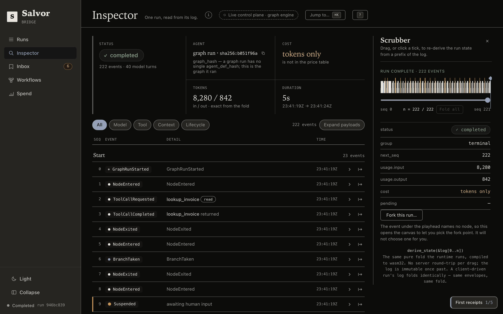
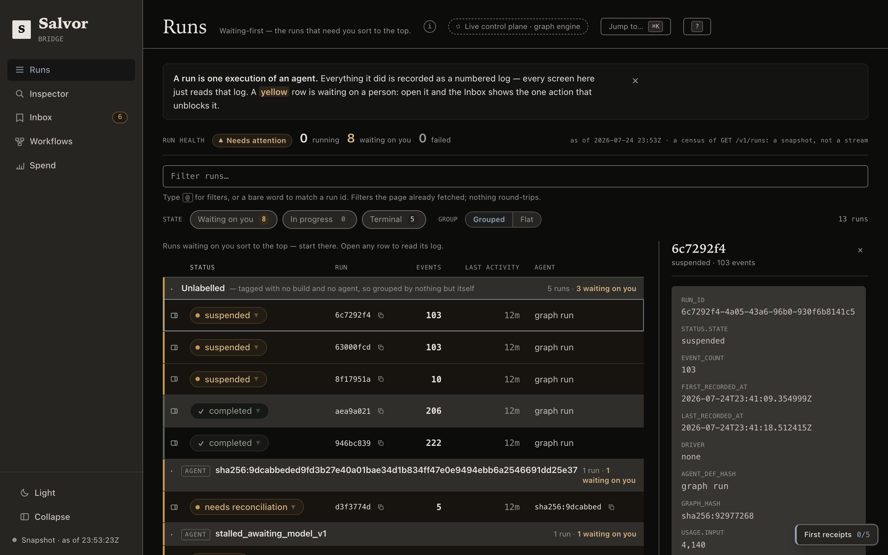
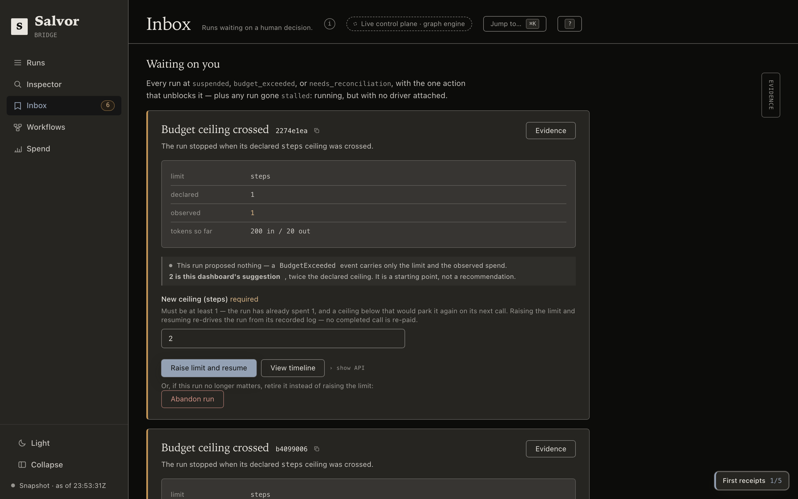
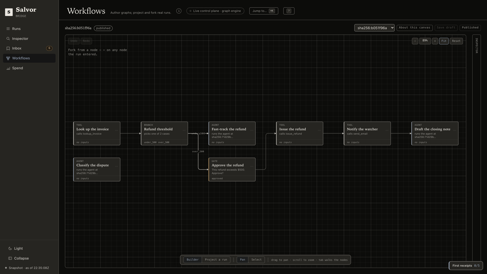

# Salvor

**A durable execution runtime for AI agents, in Rust.** `kill -9` a run mid-flight, resume it, and nothing happens twice.

A salvor is whoever goes out after the wreck and brings the ship back, which is roughly the job here: a dead run comes back and finishes from exactly where it stopped.


- **Crash-exact resume.** Every event is written before the runtime acts on it, so a resume replays what already happened and re-executes none of it.
- **No duplicate side effects.** Tools declare an effect (read, write, or idempotent) and a write is never replayed blind. A write left dangling by a crash blocks the resume until a human reconciles it.
- **The log is the run.** State is a pure fold over events: the same code in the runtime, in `salvor replay`, and in the browser via wasm.
- **Hard budgets.** Ceilings on steps, tokens, dollars, and wall time, enforced by the runtime rather than suggested to the model. Wall time is measured between recorded clock observations, never against the ambient clock.
- **One static binary.** The event store and the web UI ship inside it.

**Status:** published on crates.io, PyPI and npm; see the [releases](https://github.com/joseym/salvor/releases) for the current version. Rust 1.95 or newer.

## Quickstart

```sh
npm install -g @salvor-run/cli # prebuilt binary, no Rust toolchain
cargo install salvor-cli      # builds from source, needs Rust 1.95+
```

Or take the binary straight from the [release page](https://github.com/joseym/salvor/releases/latest), which also has a shell installer:

```sh
curl -LsSf https://github.com/joseym/salvor/releases/latest/download/salvor-cli-installer.sh | sh
```

Linux builds come in both glibc and static musl flavours, so the same binary runs on Alpine and in
slim containers. There is also a container image: see [docs/CONTAINER.md](docs/CONTAINER.md).

All routes install the same `salvor`. Examples below call it by name; from a checkout it is `./target/debug/salvor`.

An agent is a TOML file. Save this as `hello-agent.toml`:

```toml
model = "claude-opus-4-8"
system_prompt = "You are a concise assistant. Answer in one or two sentences."
```

```sh
export ANTHROPIC_API_KEY=sk-ant-...

salvor run --agent hello-agent.toml \
    --input '"What does it mean for a program to be durable?"'
```

That prints a run id and the model's answer. `salvor history <run-id>` prints what actually happened:

```
   0  2026-07-14 02:44:30Z  RunStarted           agent sha256:abd8d6f… input "What does it mean for a program to be durable?"
   1  2026-07-14 02:44:30Z  NowObserved          2026-07-14 02:44:30Z
   2  2026-07-14 02:44:30Z  ModelCallRequested   request sha256:ff62b65…
   3  2026-07-14 02:44:30Z  ModelCallCompleted   usage in 24 out 41
   4  2026-07-14 02:44:30Z  RunCompleted         output "Durability means the run's state survives a crash: every event is written befor…
```

Five events, each written before the run moved past it. Even the clock reading is recorded, because a replay has to see the same `now()` the first run saw.

### Now kill it

```sh
# starts in the background and prints its run id before the first step executes
salvor run --agent demo/agent.toml --input @demo/input.json &
kill -9 $!
salvor resume <run-id> --agent demo/agent.toml
```

The demo's MCP server appends one line per real write, so `wc -l` on that file before the kill and after the resume is the zero-duplicate proof. [`demo/README.md`](demo/README.md) has the full walkthrough, including an offline mock-model mode that needs no key and no network, the same mode that records the GIF above.

For the same story against real tools, [`examples/web-research/`](examples/web-research/) runs an agent over the official fetch and filesystem MCP servers, killing it between real HTTP fetches and a real file write.

The smallest version of all of this is [`examples/hero/`](examples/hero/), the run behind the terminal on [salvor.run](https://salvor.run): ten events, exactly one write, and no key or network needed.

```sh
salvor run --fixture examples/hero
```

## Shell completion

There are two kinds, and they compose. The static one prints a script that knows
every verb, flag, and fixed value set:

```sh
salvor completions zsh > ~/.zfunc/_salvor      # or bash, fish, elvish, powershell
```

The dynamic one adds the values only your store knows: the run ids for
`history`, `replay`, `resume`, `abandon`, `resolve` and `fork`, and the agent
identities for `salvor list --agent`. It works by calling `salvor` back on each
Tab, so add one line to your shell's rc file rather than writing a script to disk:

```sh
# ~/.zshrc, after compinit
eval "$(COMPLETE=zsh salvor)"

# ~/.bashrc
eval "$(COMPLETE=bash salvor)"
```

Then `salvor history <TAB>` offers the run ids actually in your store, newest
first, narrowing as you type; `salvor list --agent <TAB>` offers the agent
hashes present, plus `graph run` if you have run a graph. The store it reads is
the one the command would use: a `--store` already typed on the line, else
`SALVOR_STORE`, else `./salvor.db`.

It is deliberately unable to interrupt you. No store, an unreadable store, or a
store busy under another writer all produce no candidates and no message, never
an error in your prompt, and every lookup runs under a 150 ms deadline with a
cap of 50 runs inspected, so Tab never blocks on a database. Enable both: the
static script covers five shells and needs no store, and the dynamic one adds
the values to it for zsh and bash.

## The Bridge

`salvor serve` puts the runtime on a network and serves a web UI from the same binary, on the same origin. No separate deploy, no CORS.

```sh
salvor serve --bind 127.0.0.1:8080
```

The inspector reads one run from its log. Drag the scrubber and the state re-derives in the browser from a prefix of the log. That is the real `salvor-replay` crate compiled to wasm, the same fold the runtime runs, not a JavaScript reimplementation of it.



The ledger sorts runs that need a human to the top, and the inbox states the one action that unblocks each one: raise a budget ceiling, answer a gate, reconcile a write the crash left dangling.

<p align="center">
  
  
</p>

A graph is a document: nodes are agents, tools, gates and branches, and the canvas authors them and forks real runs from any node a run entered.



There is also a spend view.

Working on the UI from a checkout? `salvor serve --dev` runs the API and the Angular dev server together with hot reload, and `Ctrl-C` stops both.

## Control plane

An agent is data: `POST /v1/agents` hashes the definition and returns the hash, and every call after that references it by hash.

| | |
|---|---|
| `POST /v1/runs` | start a run |
| `GET /v1/runs/{id}/events` | stream it over SSE, with resumable cursors |
| `POST /v1/runs/{id}/resume` | continue a parked or crashed run |
| `POST /v1/runs/{id}/resolve` | record a dangling write a human verified by hand |

Every guarantee the CLI has holds over HTTP, because the same runtime enforces it. A second surface under `/v1/client-runs` inverts ownership: your client drives the agent loop and appends its own events, and the server re-folds the log on each append to confirm the event is a legal next one. Model and tool calls stay server-side, since the server holds the key and the binaries.

Full contract, every route, status code, and event shape, in [`crates/salvor-server/API.md`](crates/salvor-server/API.md). Prompt recording is off by default and writes request bodies to the durable log when enabled; see the API doc before turning it on.

A container image is published to `ghcr.io/joseym/salvor` on tagged releases, API-only with no bundled UI. See [`docs/CONTAINER.md`](docs/CONTAINER.md) for the `docker run` command and why the store volume is mandatory.

### Operating it

The durable state is one SQLite file, at the path `--store` names (plus its `-wal` and `-shm` side files while a writer holds it open). Runs and their event logs live there and survive a restart, the same store whether the process is driving `salvor run` or `salvor serve`. A submitted graph document is the exception: `salvor serve` holds it in a process-local, in-memory registry, so a restart drops it and it has to be resubmitted before a run or fork can reference it again (see [`examples/graph-clients/README.md`](examples/graph-clients/README.md#submitted-graphs-live-in-memory)). Auth is an optional shared-secret bearer token: pass `serve --auth-token <ENV_VAR>` naming an environment variable that holds it, and every `/v1` route then requires `Authorization: Bearer <token>`; leave it unset and the server trusts its caller, expecting a reverse proxy to guard it. Backing it up is copying the store file, safest with the server stopped so the `-wal` and `-shm` side files are quiescent. Against a live store, sqlite3's `.backup` command does the same job without stopping anything.

### Clients

Thin clients over the control plane: register an agent, start a run, stream events, resume. A few hundred lines each, and the durability stays in the one Rust process.

```sh
npm install @salvor-run/client     # TypeScript
pip install salvor                 # Python
```

Both also drive the client-owned mode above. See [`sdks/typescript`](sdks/typescript) and [`sdks/python`](sdks/python).

### As a Rust library

```sh
cargo add salvor
```

One dependency over the family. The default features carry the agent loop, the tool contract, the SQLite store, and the event model; `graph`, `engine`, `server`, `llm` and `wasm` are opt-in. Depending on the individual `salvor-*` crates instead is equally supported and gives a narrower build.

```rust
use salvor::prelude::*;
```

There are two tiers, and a runnable example of each in the repository: `Agent::builder()` with typed tools, and a hand-written async loop over `RunCtx` that gets the same durability without the built-in loop. From a checkout:

```sh
cargo run -p salvor-runtime --example todo_agent      # Agent::builder + typed tools
cargo run -p salvor-runtime --example approval_loop   # your own async loop over RunCtx
```

`todo_agent` prints a run id you can kill and recover with `RESUME_RUN_ID=<id>`; `approval_loop` parks for approval and completes on a second run.

## Correctness

The kill demo is one crash at one boundary. The release gate is the property suite behind it: the same run killed at *every* event boundary, resumed through the full runtime, then checked for a byte-identical final log and zero duplicate writes at each one ([`crates/salvor-runtime/tests/release_gate.rs`](crates/salvor-runtime/tests/release_gate.rs)).

<details>
<summary><strong>Workspace layout</strong></summary>

| Crate | Purpose |
|---|---|
| `salvor-core` | Stable public surface over the event model, replay, budgets, and deterministic context |
| `salvor-replay` | Pure, IO-free event vocabulary, replay cursor, and state fold; wasm32-portable |
| `salvor-store` | `EventStore` trait + SQLite (WAL) implementation |
| `salvor-store-conformance` | Proves an `EventStore` backend satisfies the trait contract |
| `salvor-llm` | Messages API client (hosted and local endpoints) |
| `salvor-tools` | `ToolHandler` trait, effect classification, MCP client |
| `salvor-tools-macros` | The `#[derive(Tool)]` macro |
| `salvor-wasm` | Sandboxed WebAssembly component tools (wasmtime, WASI p2, deny-all) |
| `salvor-runtime` | The IO edge: `RunCtx`, the `Agent` builder, the built-in loop |
| `salvor-graph` | Graph document model, validation, JSON Schema emission |
| `salvor-engine` | Executes graph documents: linear chains, gates, branches, maps, forks |
| `salvor-server` | The control plane: HTTP + SSE, server-driven and client-driven |
| `salvor-cli` | The `salvor` binary |
| `salvor` | Facade over the family: `cargo add salvor` for the library, with `graph`, `engine`, `server`, `llm` and `wasm` as opt-in features |

`bridge/` is the Angular web UI embedded in the binary. It folds logs with the real `salvor-replay` code compiled to wasm, so the scrubber runs the same state machine the server does. Neither it nor the SDKs are Cargo workspace members.

</details>

## Development

```sh
cog install-hook --all     # brew install cocogitto, if you need it
```

Commit messages follow Conventional Commits, enforced by `cog verify`. Releases are cut with `cog bump`; see [docs/RELEASING.md](docs/RELEASING.md).

## License

Dual-licensed under [MIT](LICENSE-MIT) or [Apache-2.0](LICENSE-APACHE), at your option, following the Rust ecosystem convention. Unless you state otherwise, any contribution you submit is licensed under both.
